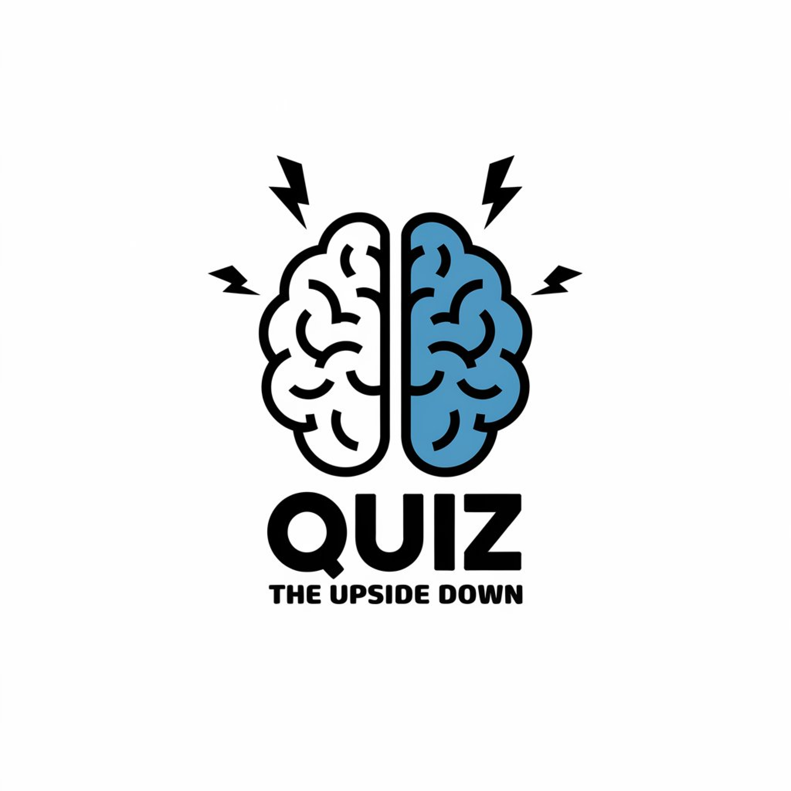

# Stranger Quiz



A Flutter-based interactive quiz app themed around the hit TV show "Stranger Things". The app features immersive UI design, sound effects, and a dimension-switching mechanic that mirrors the show's Upside Down world.

## Features

- **Immersive Stranger Things Theme**: Complete with 80s-inspired UI, show-accurate fonts, and nostalgic design elements
- **Interactive Quiz Experience**: Test your knowledge with trivia questions about the show
- **Dual World System**: Switch between Hawkins and the Upside Down with different visual themes
- **Audio Integration**: Background music and sound effects enhance the gameplay experience
- **Character Profiles**: Browse detailed information about your favorite characters
- **Dynamic Difficulty Settings**: Adjust gameplay difficulty to match your skill level
- **Animated Transitions**: Smooth animations between screens and state changes
  
## Screen Shots


# Change Theme:


## Installation Requirements

### Prerequisites
- Flutter SDK (version 3.0.0 or higher)
- Dart (version 2.17.0 or higher)
- Android Studio / VS Code with Flutter extension
- Android SDK for Android deployment
- Xcode for iOS deployment

### Dependencies
- `audioplayers`: ^4.0.0 - For sound effects and background music
- `flutter`: sdk: flutter

## Getting Started

1. **Clone the repository**
   ```bash
   git clone https://github.com/yourusername/stranger_quiz.git
   cd stranger_quiz

Install dependencies
bashflutter pub get

Run the application
bashflutter run


Project Structure
lib/
├── main.dart                # Entry point of the application
│
├── services/
│   └── audio_service.dart   # Handles all audio playback functionality
│
├── screens/
│   ├── splash_screen.dart   # Initial loading screen
│   ├── home_page.dart       # Main menu screen
│   ├── quiz_screen.dart     # Quiz gameplay screen
│   └── characters_screen.dart  # Character profiles display
│
├── widgets/
│   ├── menu_button.dart     # Custom button widget
│   └── settings_dialog.dart # Settings popup
│
└── models/
    ├── question.dart        # Question data model
    └── character.dart       # Character data model

# Assets Setup
The application requires several assets to function properly:
Fonts

BenguiatITCBold (the iconic Stranger Things font)

# Images

Character portraits
Logo
Background images for both Hawkins and the Upside Down
Result screen images

# Audio

Theme music
Button click sounds
Dimension shift effect
Correct/wrong answer sounds

# Audio Service
The app includes a global AudioService singleton that manages all sound effects and background music. It provides methods for:

Playing the theme music on a loop
Playing one-shot sound effects
Toggling audio mute functionality
Proper resource disposal

# Customization
Dimension Themes
The app features two distinct visual themes:

Hawkins: Red color scheme with normal world imagery
Upside Down: Teal color scheme with darker, alternate dimension imagery

You can customize these themes by modifying the color values and image assets in their respective sections.
# Quiz Questions
To modify or add quiz questions, locate the _questions list in the _QuizScreenState class and update as needed:
dartfinal List<Map<String, dynamic>> _questions = [
  {
    'question': 'Your question here?',
    'answers': ['Option A', 'Option B', 'Option C', 'Option D'],
    'correctIndex': 0, // Index of the correct answer
  },
  // Add more questions...
];
# Contributing
Contributions are welcome! Please feel free to submit a Pull Request.

# Fork the repository
Create your feature branch (git checkout -b feature/amazing-feature)
Commit your changes (git commit -m 'Add some amazing feature')
Push to the branch (git push origin feature/amazing-feature)
Open a Pull Request

# License
This project is licensed under the MIT License - see the LICENSE file for details.
# Acknowledgements

The Stranger Things series and its creators for inspiration
Flutter team for the amazing framework
All open-source packages used in this project


# Disclaimer: This app is a fan project and is not affiliated with, endorsed, sponsored, or specifically approved by Netflix or the creators of Stranger Things.

You can now copy this entire block of text and paste it directly into your GitHub README.md file. The formatting will work correctly on GitHub, including code blocks, headers, bullet points, and image placeholders.
